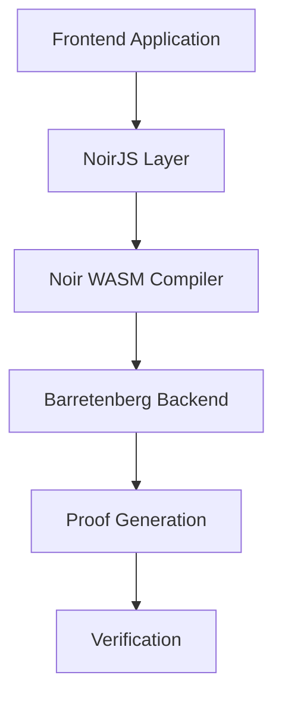

# 🎓 NoirJS PhD-Level Technical Guide

## 📚 Table of Contents
1. [Architecture Overview](#architecture-overview)
2. [Core Components](#core-components)
3. [Implementation Details](#implementation-details)
4. [Advanced Concepts](#advanced-concepts)
5. [Best Practices](#best-practices)
6. [Examples](#examples)
7. [Troubleshooting](#troubleshooting)
8. [WASM Integration](#wasm-integration)
9. [Vite Configuration](#vite-configuration)

## 🏗 Architecture Overview

### System Architecture


### Component Interaction Flow
1. **Frontend Layer**
   - User interface components
   - Input validation
   - State management
   - Proof submission

2. **NoirJS Layer**
   - Circuit compilation
   - Witness generation
   - Proof generation
   - Verification

3. **Backend Layer**
   - Barretenberg integration
   - WASM execution
   - Proof verification

## 🔧 Core Components

### 1. NoirJS Class
```typescript
class Noir {
  constructor(program: CompiledProgram);
  execute(inputs: InputMap): Promise<Witness>;
  generateProof(witness: Witness): Promise<Proof>;
  verify(proof: Proof): Promise<boolean>;
}
```

### 2. File Management
```typescript
interface FileManager {
  readFile(path: string): Promise<string>;
  writeFile(path: string, content: string): Promise<void>;
  exists(path: string): Promise<boolean>;
}
```

### 3. Circuit Compilation
```typescript
interface CompiledProgram {
  bytecode: Uint8Array;
  abi: Abi;
  verificationKey: Uint8Array;
}
```

## 💻 Implementation Details

### 1. Project Setup
```bash
# Initialize project with Bun (recommended)
curl -fsSL https://bun.sh/install | bash

# Install dependencies with specific versions
bun i @noir-lang/noir_wasm@1.0.0-beta.2 @noir-lang/noir_js@1.0.0-beta.2 @aztec/bb.js@0.72.1
```

### 2. Circuit Definition
```rust
// main.nr
fn main(age: u8) {
  assert(age >= 18);
}
```

### 3. Frontend Integration
```typescript
// CircuitLoader.ts
import { compile, createFileManager } from "@noir-lang/noir_wasm";
import main from "./circuit/src/main.nr?url";
import nargoToml from "./circuit/Nargo.toml?url";

export async function getCircuit() {
  const fm = createFileManager("/");
  const { body } = await fetch(main);
  const { body: nargoTomlBody } = await fetch(nargoToml);

  fm.writeFile("./src/main.nr", body);
  fm.writeFile("./Nargo.toml", nargoTomlBody);
  return await compile(fm);
}

// ProofGenerator.ts
import { Noir } from "noir_js";
import { UltraHonkBackend } from "@aztec/bb.js";

export class ProofGenerator {
  private noir: Noir;
  private backend: UltraHonkBackend;

  constructor(program: CompiledProgram) {
    this.noir = new Noir(program);
    this.backend = new UltraHonkBackend(program.bytecode);
  }

  async generateProof(inputs: Record<string, any>): Promise<Proof> {
    const witness = await this.noir.execute(inputs);
    return await this.backend.prove(witness);
  }
}
```

## 🔧 WASM Integration

### 1. WASM Initialization
```typescript
import initNoirC from "@noir-lang/noirc_abi";
import initACVM from "@noir-lang/acvm_js";
import acvm from "@noir-lang/acvm_js/web/acvm_js_bg.wasm?url";
import noirc from "@noir-lang/noirc_abi/web/noirc_abi_wasm_bg.wasm?url";

// Initialize WASM modules
await Promise.all([
  initACVM(fetch(acvm)),
  initNoirC(fetch(noirc))
]);
```

### 2. Vite Configuration
```javascript
// vite.config.js
export default { 
  optimizeDeps: { 
    esbuildOptions: { 
      target: "esnext" 
    } 
  } 
};
```

## 🧠 Advanced Concepts

### 1. Witness Generation
The witness is a crucial intermediate step in proof generation:
```typescript
interface Witness {
  inputs: Field[];
  outputs: Field[];
  constraints: Constraint[];
}
```

### 2. Proof Structure
```typescript
interface Proof {
  proof: Uint8Array;
  publicInputs: Field[];
  verificationKey: Uint8Array;
}
```

### 3. Circuit Optimization
- Constraint reduction
- Memory management
- WASM optimization

## 🎯 Best Practices

### 1. Error Handling
```typescript
class NoirError extends Error {
  constructor(
    message: string,
    public code: string,
    public details?: any
  ) {
    super(message);
    this.name = 'NoirError';
  }
}

// Usage
try {
  await noir.execute(inputs);
} catch (error) {
  if (error instanceof NoirError) {
    // Handle specific Noir errors
  }
}
```

### 2. Performance Optimization
- Lazy loading of WASM modules
- Caching of compiled circuits
- Batch processing of proofs

### 3. Security Considerations
- Input validation
- Proof verification
- Memory management
- WASM security

## 📝 Examples

### 1. Age Verification Circuit
```rust
// age_verification.nr
fn main(age: u8) {
  assert(age >= 18);
}
```

```typescript
// AgeVerification.ts
export class AgeVerification {
  private proofGenerator: ProofGenerator;

  constructor(program: CompiledProgram) {
    this.proofGenerator = new ProofGenerator(program);
  }

  async verifyAge(age: number): Promise<boolean> {
    const proof = await this.proofGenerator.generateProof({ age });
    return await this.proofGenerator.backend.verifyProof(proof);
  }
}
```

### 2. Range Proof Circuit
```rust
// range_proof.nr
fn main(value: Field, min: pub Field, max: pub Field) -> pub bool {
    let in_range = value >= min && value <= max;
    assert(in_range);
    in_range
}
```

## 🔍 Troubleshooting

### Common Issues
1. WASM Loading Failures
   - Check CORS settings
   - Verify WASM file paths
   - Ensure proper MIME types
   - Use `?url` imports with Vite

2. Circuit Compilation Errors
   - Syntax validation
   - Constraint checking
   - Memory allocation

3. Proof Generation Failures
   - Input validation
   - Witness generation
   - Backend initialization

### Debugging Tools
```typescript
// DebugLogger.ts
export class DebugLogger {
  static logCircuit(circuit: CompiledProgram): void {
    console.log('Circuit ABI:', circuit.abi);
    console.log('Bytecode size:', circuit.bytecode.length);
  }

  static logWitness(witness: Witness): void {
    console.log('Inputs:', witness.inputs);
    console.log('Outputs:', witness.outputs);
  }
}
```

## 📚 References

1. [NoirJS Documentation](https://noir-lang.org/docs/tutorials/noirjs_app)
2. [Barretenberg Documentation](https://github.com/AztecProtocol/barretenberg)
3. [Noir Language Reference](https://noir-lang.org/docs/reference)

## 🔄 Version History

- v1.0.0-beta.2: Current stable version
- v1.0.0-beta.1: Previous version
- v0.x.x: Legacy versions

## 📈 Future Improvements

1. Circuit Optimization
   - Constraint reduction
   - Memory management
   - Parallel processing

2. Developer Experience
   - Better error messages
   - Development tools
   - Testing utilities

3. Integration
   - Smart contract integration
   - Web3 frameworks
   - Cloud services

## 🎯 Next Steps

1. Install nargo and write Noir tests
2. Modify circuits to accept public inputs
3. Implement structs and traits in Noir
4. Explore framework integrations
5. Build more complex ZK applications 