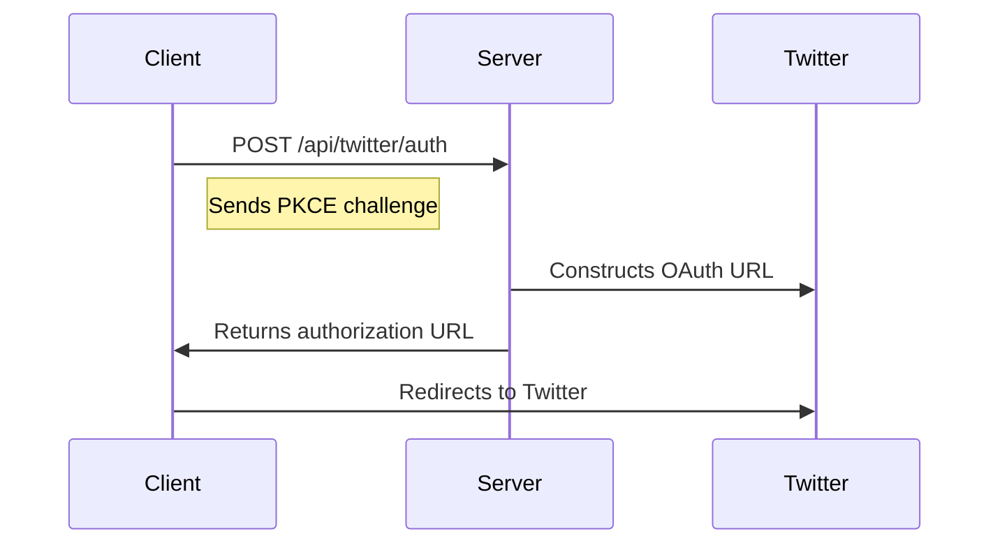
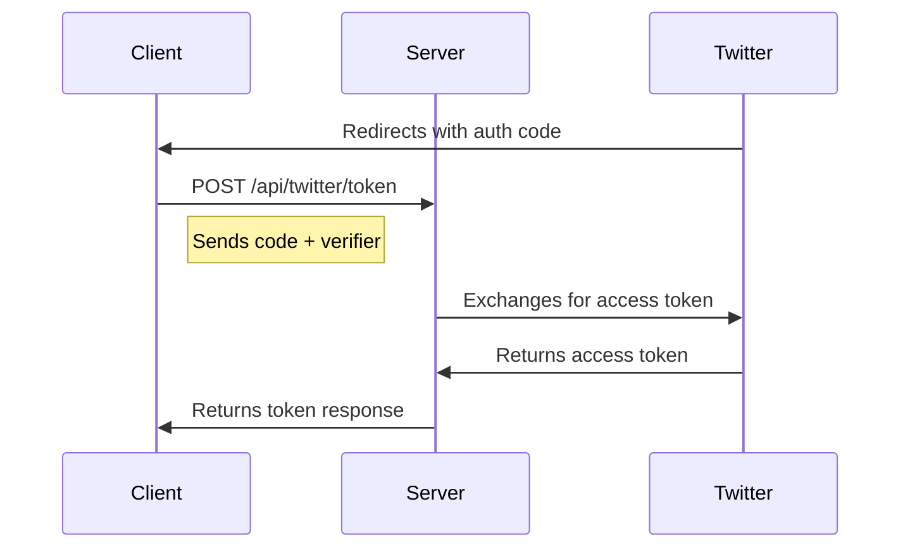
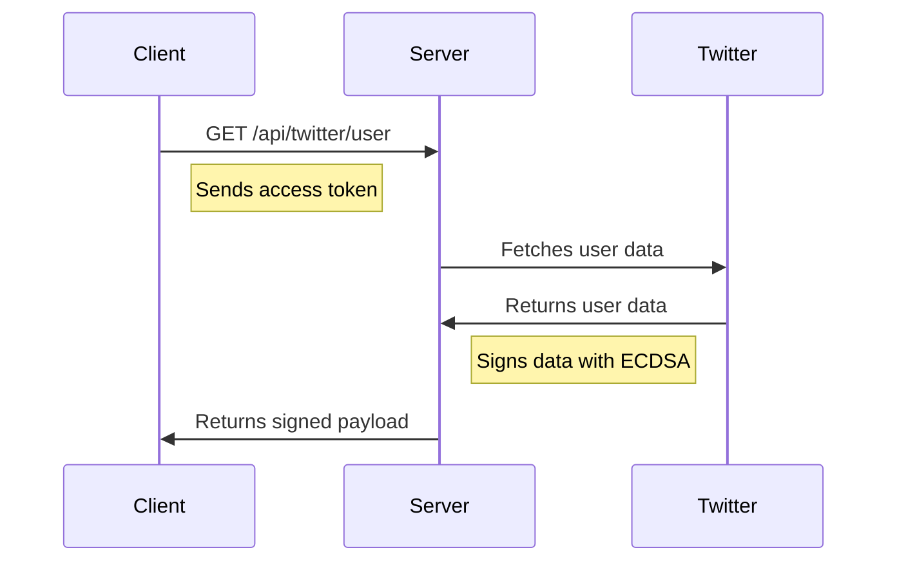

# Backend Technical Documentation

## Overview
This document provides a detailed technical explanation of the backend implementation for the Twitter OAuth 2.0 authentication system with ECDSA signing capabilities.

## Table of Contents
1. [Architecture](#architecture)
2. [Dependencies](#dependencies)
3. [Authentication Flow](#authentication-flow)
4. [API Endpoints](#api-endpoints)
5. [Cryptographic Operations](#cryptographic-operations)
6. [Security Considerations](#security-considerations)
7. [Error Handling](#error-handling)
8. [Environment Configuration](#environment-configuration)

## Architecture

### Core Components
- Express.js server
- Twitter OAuth 2.0 integration
- ECDSA signing system
- PKCE (Proof Key for Code Exchange) implementation

### File Structure
```
server/
├── index.ts           # Server initialization
├── routes/
│   └── twitter.ts     # Twitter authentication routes
└── config/
    └── .env          # Environment variables
```

## Dependencies

### Primary Dependencies
```json
{
  "express": "^4.18.2",      // Web server framework
  "elliptic": "^6.5.4",      // ECDSA cryptography
  "axios": "^1.6.7",         // HTTP client
  "cors": "^2.8.5",          // Cross-Origin Resource Sharing
  "dotenv": "^16.4.5"        // Environment variables management
}
```

### Cryptographic Libraries
- **elliptic**: Implements secp256k1 curve operations
- **crypto** (Node.js built-in): Used for SHA-256 hashing

## Authentication Flow

### 1. Initial Authorization Request


### 2. Code Exchange


### 3. User Data & Signing


## API Endpoints

### POST /api/twitter/auth
Generates Twitter OAuth URL with PKCE.

#### Request
\`\`\`typescript
{
  code_challenge: string;  // PKCE challenge
  state?: string;         // Optional state parameter
}
\`\`\`

#### Response
\`\`\`typescript
{
  url: string;  // Twitter authorization URL
}
\`\`\`

#### Implementation Details
\`\`\`typescript
router.post('/auth', async (req, res) => {
    const { code_challenge, state } = req.body;
    
    // Validation
    if (!code_challenge) {
        return res.status(400).json({ error: 'Code challenge is required' });
    }

    // URL Parameters
    const params = new URLSearchParams({
        response_type: 'code',
        client_id: process.env.TWITTER_CLIENT_ID!,
        redirect_uri: process.env.REDIRECT_URI!,
        scope: 'tweet.read users.read',
        code_challenge: code_challenge,
        code_challenge_method: 'S256',
        state: state || crypto.randomBytes(32).toString('hex')
    });

    const authUrl = \`https://twitter.com/i/oauth2/authorize?\${params}\`;
    res.json({ url: authUrl });
});
\`\`\`

### POST /api/twitter/token
Exchanges authorization code for access token.

#### Request
\`\`\`typescript
{
  code: string;          // Authorization code from Twitter
  code_verifier: string; // Original PKCE verifier
}
\`\`\`

#### Response
\`\`\`typescript
{
  access_token: string;
  token_type: string;
  expires_in: number;
  scope: string;
}
\`\`\`

#### Implementation Details
\`\`\`typescript
router.post('/token', async (req, res) => {
    const { code, code_verifier } = req.body;

    const params = new URLSearchParams({
        grant_type: 'authorization_code',
        code,
        redirect_uri: process.env.REDIRECT_URI!,
        code_verifier
    });

    // Basic auth with client credentials
    const auth = Buffer.from(
        \`\${process.env.TWITTER_CLIENT_ID}:\${process.env.TWITTER_CLIENT_SECRET}\`
    ).toString('base64');

    const response = await axios.post(
        'https://api.twitter.com/2/oauth2/token',
        params.toString(),
        {
            headers: {
                'Content-Type': 'application/x-www-form-urlencoded',
                'Authorization': \`Basic \${auth}\`
            }
        }
    );

    res.json(response.data);
});
\`\`\`

### GET /api/twitter/user
Fetches and signs user data.

#### Request Headers
\`\`\`
Authorization: Bearer <access_token>
\`\`\`

#### Response
\`\`\`typescript
{
  twitter_data: {
    id: string;
    created_at: string;
    [key: string]: any;
  };
  messageHash: string;    // SHA-256 hash of data
  signature: {
    r: string;           // ECDSA signature component
    s: string;           // ECDSA signature component
  };
  publicKey: {
    x: string;           // Public key X coordinate
    y: string;           // Public key Y coordinate
  };
}
\`\`\`

#### Implementation Details
\`\`\`typescript
router.get('/user', async (req, res) => {
    const token = req.headers.authorization?.split(' ')[1];

    // Fetch user data
    const response = await axios.get('https://api.twitter.com/2/users/me', {
        headers: {
            'Authorization': \`Bearer \${token}\`,
        },
        params: {
            'user.fields': 'created_at,public_metrics'
        }
    });

    const userData = response.data.data;

    // Sign data
    const serializedData = JSON.stringify(userData, Object.keys(userData).sort());
    const msgHash = crypto.createHash('sha256').update(serializedData).digest();
    const signature = key.sign(msgHash);

    res.json({
        twitter_data: userData,
        messageHash: msgHash.toString('hex'),
        signature: {
            r: signature.r.toString(16),
            s: signature.s.toString(16)
        },
        publicKey: {
            x: key.getPublic().getX().toString(16),
            y: key.getPublic().getY().toString(16)
        }
    });
});
\`\`\`

## Cryptographic Operations

### ECDSA Key Generation
```typescript
const ec = new elliptic.ec('secp256k1');
const key = ec.genKeyPair();
```
- Uses secp256k1 curve (same as Bitcoin)
- Generates new key pair on server start
- In production, should use secure key storage

### Data Signing Process
1. **Data Serialization**
   ```typescript
   const serializedData = JSON.stringify(userData, Object.keys(userData).sort());
   ```
   - Sorts keys for deterministic output
   - Ensures consistent hashing

2. **Hash Generation**
   ```typescript
   const msgHash = crypto.createHash('sha256').update(serializedData).digest();
   ```
   - Uses SHA-256 for message digest
   - Returns Buffer of hash

3. **ECDSA Signing**
   ```typescript
   const signature = key.sign(msgHash);
   ```
   - Signs hash with private key
   - Returns signature object with r,s components

## Security Considerations

### PKCE Implementation
- Prevents authorization code interception attacks
- Uses SHA-256 for code challenge generation
- Verifies code_verifier server-side

### State Parameter
- Prevents CSRF attacks
- Generated using cryptographically secure random bytes
- Verified during callback

### Access Token Handling
- Never stored server-side
- Transmitted only over HTTPS
- Validated for each user data request

### ECDSA Key Management
- New keypair generated on server start
- Private key never exposed
- Public key components included in response

## Error Handling

### Common Error Scenarios
1. Missing PKCE challenge
2. Invalid authorization code
3. Failed token exchange
4. Invalid access token
5. Twitter API errors

### Error Response Format
```typescript
{
  error: string;        // Error description
  status?: number;      // HTTP status code
  details?: any;        // Additional error details
}
```

## Environment Configuration

### Required Variables
```env
TWITTER_CLIENT_ID=your_client_id
TWITTER_CLIENT_SECRET=your_client_secret
REDIRECT_URI=http://localhost:5174/callback
PORT=3000
```

### Optional Variables
```env
NODE_ENV=development
CORS_ORIGIN=http://localhost:5174
LOG_LEVEL=debug
```

## Testing

### Manual Testing Steps
1. Start server with valid environment variables
2. Initiate login flow from frontend
3. Verify Twitter redirect
4. Check token exchange
5. Validate signed user data

### Verification Process
```typescript
// Verify signature
const msgHash = crypto.createHash('sha256')
    .update(JSON.stringify(userData, Object.keys(userData).sort()))
    .digest();

const publicKey = ec.keyFromPublic({
    x: response.publicKey.x,
    y: response.publicKey.y
}, 'hex');

const isValid = publicKey.verify(msgHash, response.signature);
``` 