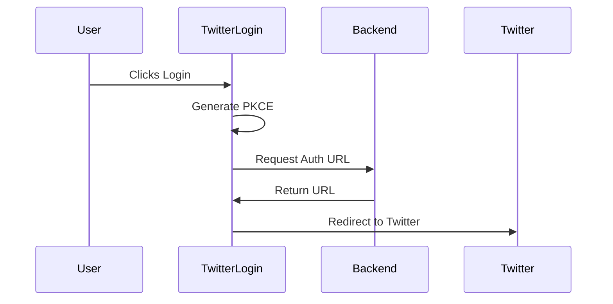
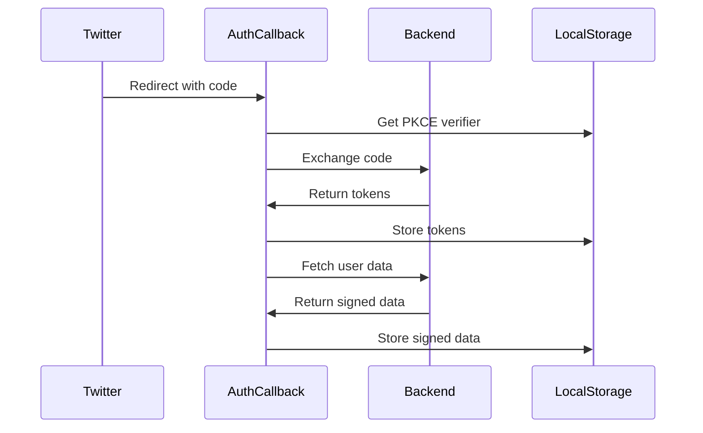

# Frontend Technical Documentation

## Overview
This document provides a detailed technical explanation of the frontend implementation for the Twitter OAuth 2.0 authentication system with Web Components.

## Table of Contents
1. [Architecture](#architecture)
2. [Components](#components)
3. [Authentication Flow](#authentication-flow)
4. [State Management](#state-management)
5. [Security Features](#security-features)
6. [UI/UX Considerations](#uiux-considerations)
7. [Error Handling](#error-handling)

## Architecture

### Core Technologies
- Web Components (Custom Elements)
- TypeScript
- Vite (Build Tool)
- Shadow DOM for encapsulation

### File Structure
```
src/
├── components/
│   ├── App.ts
│   ├── TwitterLogin.ts
│   ├── AuthenticatedView.ts
│   └── AuthCallback.ts
├── styles/
│   ├── twitter-login.styles.ts
│   └── authenticated-view.styles.ts
├── utils/
│   └── pkce.ts
└── types/
    └── twitter.types.ts
```

## Components

### App Component
Main application component that handles view switching based on authentication state.

```typescript
export class App extends HTMLElement {
    private render(): void {
        const isAuthenticated = localStorage.getItem('twitter_token') 
            && localStorage.getItem('twitter_signed_data');

        this.shadowRoot!.innerHTML = `
            <style>${styles}</style>
            <div class="container">
                <h1>Twitter Authentication</h1>
                ${isAuthenticated 
                    ? '<authenticated-view></authenticated-view>' 
                    : '<twitter-login></twitter-login>'}
            </div>
        `;
    }
}
```

### TwitterLogin Component
Handles the initial authentication process and PKCE challenge generation.

#### Key Features
- PKCE challenge generation
- Twitter OAuth URL retrieval
- Error handling and UI feedback
- Loading states

```typescript
export class TwitterLogin extends HTMLElement {
    private async handleLogin(): Promise<void> {
        this.setLoading(true);
        
        try {
            const { verifier, challenge } = await generatePKCEChallenge();
            const state = crypto.randomUUID();

            // Store authentication state
            localStorage.setItem('pkce_verifier', verifier);
            localStorage.setItem('oauth_state', state);

            const authUrl = await this.getAuthorizationUrl(challenge, state);
            window.location.href = authUrl;
        } catch (error) {
            this.showError(error instanceof Error 
                ? error.message 
                : 'Failed to initiate login');
        }
    }
}
```

### AuthenticatedView Component
Displays user data and ECDSA signature information after successful authentication.

#### Features
- Displays Twitter user data
- Shows ECDSA signature components
- Provides logout functionality
- Responsive design

```typescript
export class AuthenticatedView extends HTMLElement {
    private renderDataSection(title: string, fields: Record<string, string | undefined>): string {
        const fieldHtml = Object.entries(fields)
            .map(([label, value]) => `
                <div class="data-field">
                    <strong>${label}:</strong> ${value || 'N/A'}
                </div>
            `)
            .join('');

        return `
            <div class="data-container">
                <div class="data-title">${title}</div>
                ${fieldHtml}
            </div>
        `;
    }
}
```

### AuthCallback Component
Handles the OAuth callback and token exchange process.

#### Implementation Details
```typescript
export class AuthCallback extends HTMLElement {
    private async handleCallback(): Promise<void> {
        try {
            const urlParams = new URLSearchParams(window.location.search);
            const code = urlParams.get('code');
            const state = urlParams.get('state');
            const verifier = localStorage.getItem('pkce_verifier');
            const storedState = localStorage.getItem('oauth_state');

            // Validate state to prevent CSRF
            if (state !== storedState) {
                throw new Error('Invalid state parameter');
            }

            // Exchange code for token
            const tokenData = await this.exchangeCodeForToken(code!, verifier!);
            
            // Fetch and store signed user data
            await this.fetchAndStoreUserData(tokenData.access_token);

            // Cleanup and redirect
            this.cleanupStorageAndRedirect();
        } catch (error) {
            this.handleError(error);
        }
    }
}
```

## Authentication Flow

### 1. Login Initiation


### 2. OAuth Callback


## State Management

### Local Storage Schema
```typescript
interface StorageSchema {
    twitter_token: string;        // Access token
    twitter_signed_data: string;  // Signed user data
    pkce_verifier: string;       // PKCE verifier
    oauth_state: string;         // CSRF state
}
```

### Storage Operations
```typescript
class StorageManager {
    static setAuthData(token: string, signedData: string): void {
        localStorage.setItem('twitter_token', token);
        localStorage.setItem('twitter_signed_data', JSON.stringify(signedData));
    }

    static clearAuthData(): void {
        localStorage.removeItem('twitter_token');
        localStorage.removeItem('twitter_signed_data');
        localStorage.removeItem('pkce_verifier');
        localStorage.removeItem('oauth_state');
    }
}
```

## Security Features

### PKCE Implementation
```typescript
export async function generatePKCEChallenge(): Promise<PKCEChallenge> {
    // Generate random verifier
    const array = new Uint8Array(32);
    crypto.getRandomValues(array);
    const verifier = Array.from(array)
        .map(b => b.toString(16).padStart(2, '0'))
        .join('');

    // Create SHA-256 challenge
    const encoder = new TextEncoder();
    const data = encoder.encode(verifier);
    const hash = await crypto.subtle.digest('SHA-256', data);
    const challenge = btoa(String.fromCharCode(...new Uint8Array(hash)))
        .replace(/\+/g, '-')
        .replace(/\//g, '_')
        .replace(/=+$/, '');

    return { verifier, challenge };
}
```

### CSRF Protection
- State parameter validation
- Secure random generation
- Storage in localStorage

## UI/UX Considerations

### Loading States
```typescript
private setLoading(isLoading: boolean): void {
    if (!this.button) return;
    this.button.disabled = isLoading;
    this.button.textContent = isLoading ? 'Connecting...' : 'Sign in with Twitter';
}
```

### Error Feedback
```typescript
private showError(message: string): void {
    if (!this.errorDiv) return;
    this.errorDiv.textContent = message;
    this.errorDiv.classList.add('visible');
    this.setLoading(false);
}
```

### Animations
```typescript
const styles = `
    .data-container {
        transition: transform 0.2s, box-shadow 0.2s;
    }

    .data-container:hover {
        transform: translateY(-2px);
        box-shadow: 0 4px 12px rgba(0, 0, 0, 0.1);
    }
`;
```

## Error Handling

### Common Error Scenarios
1. Network failures
2. Invalid PKCE verification
3. Twitter API errors
4. Storage access issues
5. Component initialization failures

### Error Response Handling
```typescript
private async handleError(error: unknown): Promise<void> {
    console.error('Authentication error:', error);
    
    const message = error instanceof Error 
        ? error.message 
        : 'An unexpected error occurred';

    this.shadowRoot!.innerHTML = `
        <div class="message error">
            Authentication failed: ${message}
            <br><br>
            <a href="/">Return to home</a>
        </div>
    `;
}
```

### Network Error Recovery
```typescript
private async fetchWithRetry<T>(
    url: string, 
    options: RequestInit, 
    retries: number = 3
): Promise<T> {
    for (let i = 0; i < retries; i++) {
        try {
            const response = await fetch(url, options);
            if (!response.ok) throw new Error(response.statusText);
            return await response.json();
        } catch (error) {
            if (i === retries - 1) throw error;
            await new Promise(resolve => setTimeout(resolve, 1000 * Math.pow(2, i)));
        }
    }
    throw new Error('Max retries exceeded');
}
``` 